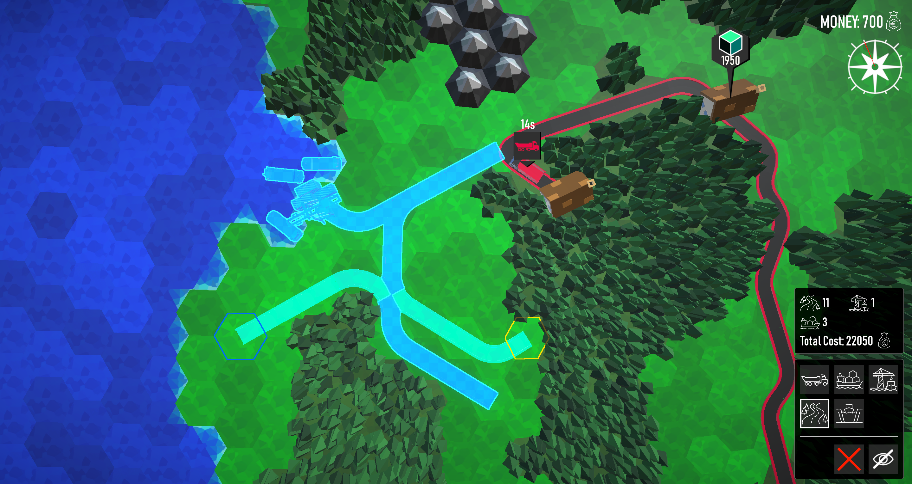
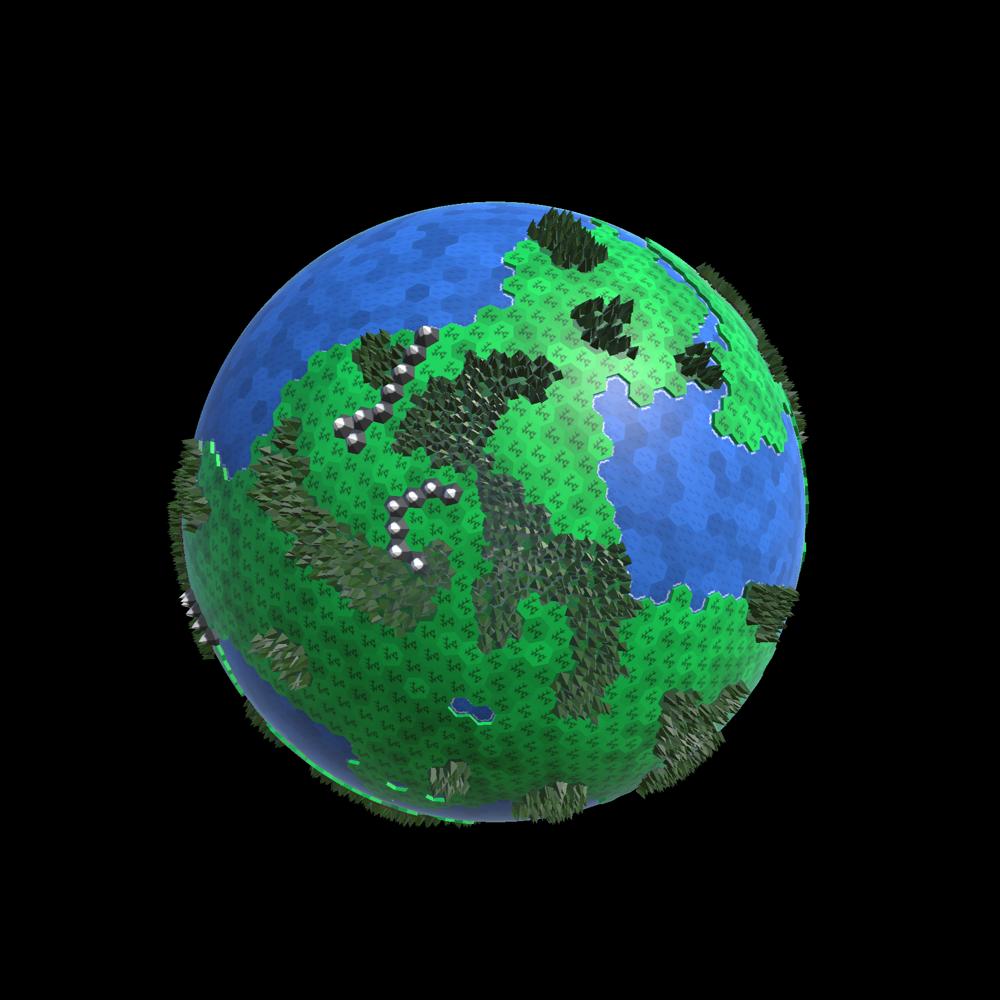
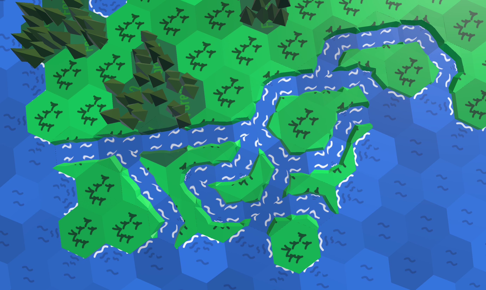

# Global Logistics

Global Logistics is an online RTS logistics simulator, that is still accessible to the average person. For a detailed description, please refer to the [Wiki](https://collab.dvb.bayern/spaces/TUMgameslab2026summer/pages/2718499622/Global+Logistics).

## Gameplay Video

  

## Technical Details

Many of the things in this game are procedurally generated. First we generate the spherical map based on an icosphere, then we generate the environment (oceans, continents, mountains and forests). The geometries of roads and canals are also generated procedurally to allow for smooth intersections. 

  <table>
    <tr>
      <td align="center">
         
        
Map geometry

      </td>
      <td align="center">
         
        
Resulting Map

      </td>
    </tr>
  </table>

  <table>
    <tr>
      <td align="center">
         
        
Procedural road geometry

      </td>
      <td align="center">
         
        
Procedural canals

      </td>
    </tr>
  </table>

   
  
Vertex shader projection, so that more of the spherical map is visible when zooming in.

For more details refer to the respective pages in the wiki:
* [Technical Details](https://collab.dvb.bayern/spaces/TUMgameslab2026summer/pages/2718499670/Technical+Details)
* [Map Generation](https://collab.dvb.bayern/spaces/TUMgameslab2026summer/pages/2718499678/Map+Generation)
* [Geometry Generation](https://collab.dvb.bayern/spaces/TUMgameslab2026summer/pages/2718499686/Geometry+Generation)
* [Road and Canal Geometry Generation](https://collab.dvb.bayern/spaces/TUMgameslab2026summer/pages/2836859811/Road-+Canal+Geometry+Generation)